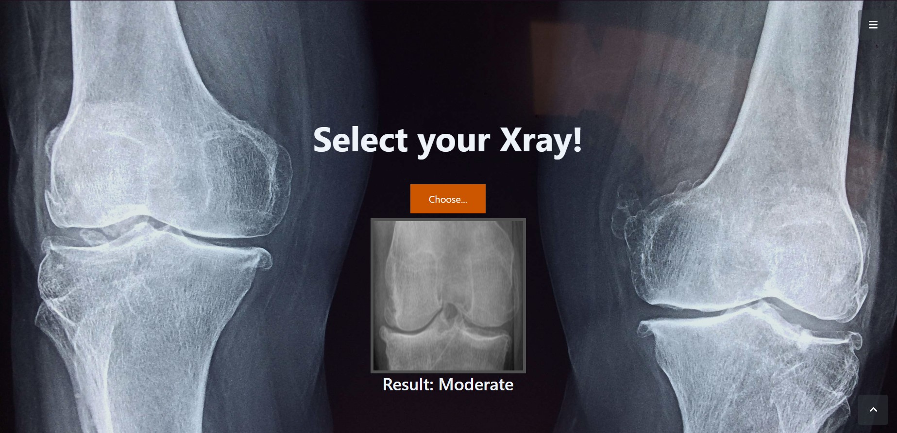

# Knee Osteoarthritis Detection and KL Grading using AlexNet5 and Xception Models

This project is aimed at developing deep learning models for the detection of knee osteoarthritis and grading the Kellgren-Lawrence (KL) severity using two models: a manually trained AlexNet5 and a fine-tuned Xception model.

## Dataset

The project uses a dataset of digital knee X-ray images, which was obtained from Mendeley Data with the following citation:

Gornale, Shivanand; Patravali, Pooja (2020), “Digital Knee X-ray Images”, Mendeley Data, V1, doi: 10.17632/t9ndx37v5h.1

The dataset consists of 1650 digital X-ray images of knee joint which are collected from well reputed hospitals and diagnostic centres. The X-ray images are acquired using PROTEC PRS 500E X-ray machine. Original images are 8-bit grayscale image.  Each radiographic knee X-ray image is manually annotated /labelled as per Kellgren and Lawrence grades(0-4).

## Prerequisites

- Python 3.10.0
- TensorFlow 2.10.1
- Bazel 5.1.1
- cuDNN 8.1
- CUDA 11.2
- Keras
- Numpy
- Pandas
- Scikit-learn
- Matplotlib
- Seaborn
- openCV

## Installation

1. Clone the repository to your local machine.
2. Install the required packages using the following command:

```
pip install -r requirements.txt
```

## Usage

### Model Training and Preprocessing

1. Open the '**model.ipynb**' notebook using Jupyter Notebook or JupyterLab.
2. Follow the instructions in the notebook to preprocess the data and train the models.

### Testing

1. Open the '**XrayChecker.ipynb**' notebook using Jupyter Notebook or JupyterLab.
2. Follow the instructions in the notebook to test the trained models on new data.

### Model Saving and Logs

1. After training the models, they will be saved in the current directory as 'AlexNet5.hdf5' and '**XceptionModel.hdf5**'.
2. The training logs for both models will be saved in the current directory as `alexnet5_history.log` and `xception_history.log`.

## Results

1. The manually trained AlexNet5 model achieved a training accuracy of 43.59% and a test accuracy of 40.00% for multi-class classification of KL classification 0-4. 

2. The fine-tuned Xception model achieved a training accuracy of 83.32% and a test accuracy of 82.67% for the same multi-class KL classification.

## Website

Landing Page | About
--- | ---
) | )

Application | Application Working 
--- | ---
 | 


## Credits

This project was developed by [Subhrajit Panda].

## License

This project is licensed under the Apache License, Version 2.0 - see the [LICENSE](LICENSE) file for details.
